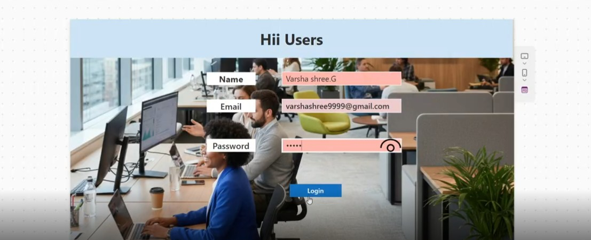
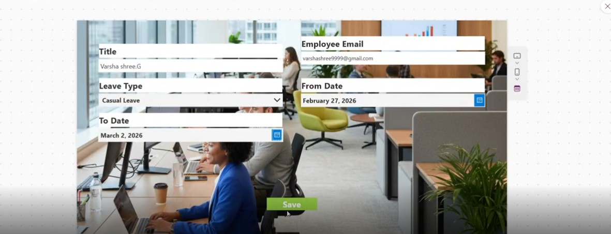
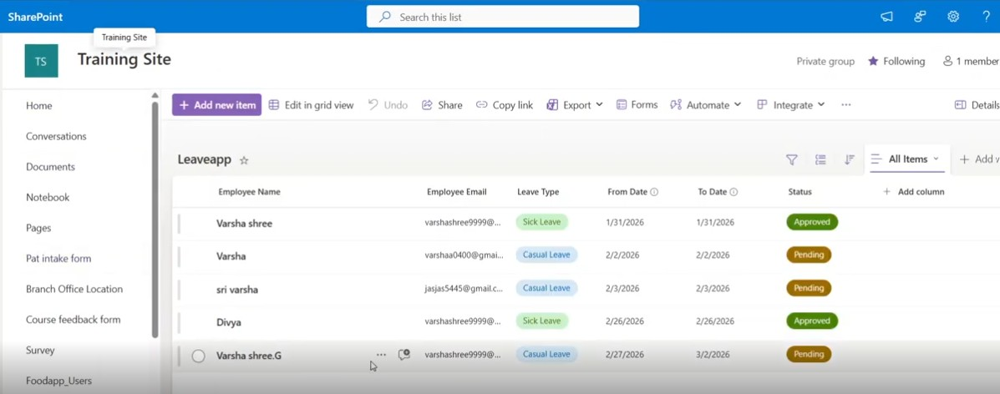
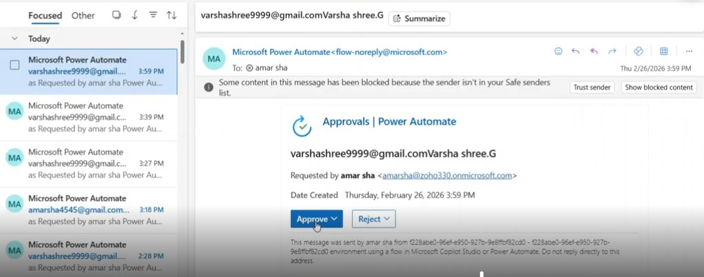
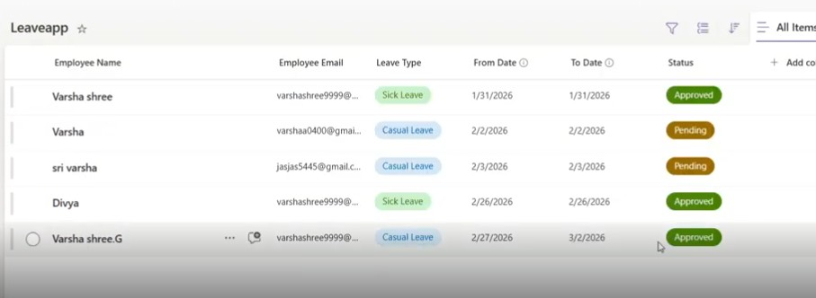

# leave-management-canvas apps
Leave management app using Power Apps & Automate, Share point as a Backend.

The Leave Management System is a Power Apps-based application designed to streamline and automate the process of applying, tracking, and approving employee leave requests.

This application helps organizations manage leave efficiently by reducing manual work and improving transparency between employees and managers.

Features
- Employees can apply for leave 
- Automated approval workflow using Power Automate
- Real-time leave status tracking (Pending / Approved / Rejected)
- Centralized data storage for all leave records

Technologies Used
- Microsoft Power Apps (Canvas App)
- Power Automate (Flow automation)
- SharePoint (Data source)

 Key Highlights
- User-friendly interface for easy navigation
- Reduces manual errors and paperwork
- Improves communication between employees and management
- Scalable solution for small to medium organizations

## 🎥 Demo Video https://drive.google.com/file/d/1dirYMhpz2XfSCvDyAbzA2BcZ5t8a_0K-/view?usp=sharing

## 📸 Screenshots

